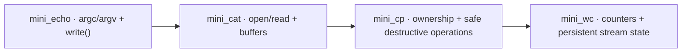

<div align="center">

# unix-toolbox

**Small Unix utilities rebuilt in C, one mechanism at a time.**

[](https://github.com/maximecoia/unix-toolbox/actions/workflows/ci.yml)
[](https://en.wikipedia.org/wiki/C99)

`mini_echo` → `mini_cat` → `mini_cp` → `mini_wc`

</div>

---

## About

`unix-toolbox` is a small post-Piscine project built to deepen my understanding of C and Unix programming through progressively more demanding command-line utilities.

Each program keeps a deliberately limited scope so the implementation can be understood end to end: inputs, state, control flow, system calls, failure paths, and exact observable behavior.

The goal is not to clone the full GNU/BSD commands. It is to rebuild a focused subset of their behavior and understand the mechanisms underneath.

## Progress

| Command | Main focus | Status |
|---|---|---|
| [`mini_echo`](mini_echo/) | `argc`, `argv`, nested traversal, `write()` | **Complete** |
| [`mini_cat`](mini_cat/) | file descriptors, `open()`, `read()`, buffers, EOF, partial writes | **Complete** |
| [`mini_cp`](mini_cp/) | multiple descriptors, safe `O_TRUNC`, file identity | **Complete** |
| [`mini_wc`](mini_wc/) | counters, stream state, checked result output | **Complete** |

## Progression



## Completed sequence

### mini_echo

```text
argv -> characters -> write()
```

Introduces argument traversal, separator placement, and checked byte output.

### mini_cat

```text
path -> open() -> read() -> buffer -> stdout
```

Introduces file descriptors, EOF, buffering, and partial writes.

### mini_cp

```text
source fd -> buffer -> destination fd
```

Adds multiple-resource ownership, destination creation/truncation, same-file detection, regular-file validation, and safety checks before destructive operations.

### mini_wc

```text
file -> buffer -> state transitions -> counters
```

Adds stream-wide state, word-boundary detection, byte/line/word counters, manual number formatting, and checked final output.

## Build

Requirements:

- a C99-compatible compiler;
- `make`;
- a POSIX-compatible shell.

Build everything:

```sh
make
```

Build one utility:

```sh
make mini_wc
```

Binaries are written to `bin/`.

## Test

Run all behavioral suites:

```sh
make test
```

Compile and test:

```sh
make check
```

Expected final result:

```text
PASS: mini_echo
PASS: mini_cat
PASS: mini_cp
PASS: mini_wc

Suites: 4 passed, 0 skipped, 0 failed
```

## Repository structure

```text
unix-toolbox/
├── mini_echo/
│   ├── README.md
│   └── mini_echo.c
├── mini_cat/
│   ├── README.md
│   └── mini_cat.c
├── mini_cp/
│   ├── README.md
│   └── mini_cp.c
├── mini_wc/
│   ├── README.md
│   └── mini_wc.c
├── tests/
├── docs/
├── .github/workflows/ci.yml
├── Makefile
└── README.md
```

## Project rules

- keep each utility small enough to understand end to end;
- derive control flow from required behavior rather than from remembered code;
- check system calls instead of assuming success;
- validate before destructive operations;
- preserve stream-wide state across buffer boundaries;
- test exact output, file contents, failure paths, and exit status;
- add abstractions only when they solve a real problem.

## Status

The first `unix-toolbox` sequence is complete.

A detailed progression overview is available in [`docs/roadmap.md`](docs/roadmap.md).
