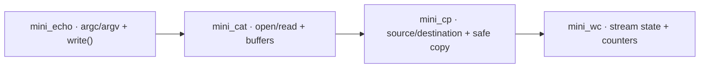

<div align="center">

# unix-toolbox

**Small Unix utilities rebuilt in C, one mechanism at a time.**

[](https://github.com/maximecoia/unix-toolbox/actions/workflows/ci.yml)
[](https://en.wikipedia.org/wiki/C99)

`mini_echo` → `mini_cat` → `mini_cp` → `mini_wc`

</div>

---

## About

`unix-toolbox` is a small post-Piscine project built to deepen my understanding of C and Unix programming through progressively more demanding command-line utilities.

Each program keeps a deliberately limited scope so the implementation can be understood end to end: inputs, state, control flow, system calls, failure paths, and exact observable behavior.

The goal is not to clone the full GNU/BSD commands. It is to rebuild a focused subset of their behavior and understand the mechanisms underneath.

## Progress

| Command | Main focus | Status |
|---|---|---|
| [`mini_echo`](mini_echo/) | `argc`, `argv`, nested traversal, `write()` | **Complete** |
| [`mini_cat`](mini_cat/) | file descriptors, `open()`, `read()`, buffers, EOF, partial writes | **Complete** |
| [`mini_cp`](mini_cp/) | source/destination descriptors, `O_CREAT`, `O_TRUNC`, same-file safety | **Complete** |
| [`mini_wc`](mini_wc/) | counters and stream state | Not started |

## Progression



Each step reuses part of the previous one and adds a new problem.

## Current milestone

### mini_cp

The third completed utility reproduces a deliberately small subset of `cp`.

Current scope:

```text
usage: mini_cp source destination
```

Example:

```sh
./bin/mini_cp source.txt copy.txt
```

It focuses on:

- validating exactly one source and one destination;
- opening the source read-only;
- inspecting file identity before truncating the destination;
- rejecting copies where source and destination resolve to the same file;
- creating or truncating the destination with `open()`;
- copying data through a fixed-size buffer;
- handling partial writes with a reusable `write_all()` helper;
- closing both owned file descriptors on normal and error paths.

Implementation notes and tests: [`mini_cp/README.md`](mini_cp/README.md)

## Build

Requirements:

- a C99-compatible compiler;
- `make`;
- a POSIX-compatible shell.

Build all utilities:

```sh
make
```

Build one utility:

```sh
make mini_cp
```

Binaries are written to `bin/`.

## Test

Run all active suites:

```sh
make test
```

Compile and test:

```sh
make check
```

Run the `mini_cp` suite directly:

```sh
sh tests/test_mini_cp.sh
```

Unfinished commands keep the marker:

```c
/* PROJECT_STATUS: TODO */
```

Their suites are skipped until the implementation is activated.

## Repository structure

```text
unix-toolbox/
├── mini_echo/
│   ├── README.md
│   └── mini_echo.c
├── mini_cat/
│   ├── README.md
│   └── mini_cat.c
├── mini_cp/
│   ├── README.md
│   └── mini_cp.c
├── mini_wc/
├── tests/
├── docs/
├── .github/workflows/ci.yml
├── Makefile
└── README.md
```

## Project rules

- keep each utility small enough to understand end to end;
- derive control flow from required behavior rather than from remembered code;
- check system calls instead of assuming success;
- protect data before destructive operations such as `O_TRUNC`;
- test exact output, file contents, and exit status;
- add abstractions only when they solve a real problem.

## Roadmap

The next utility is [`mini_wc`](mini_wc/).

A short progression overview is available in [`docs/roadmap.md`](docs/roadmap.md).
