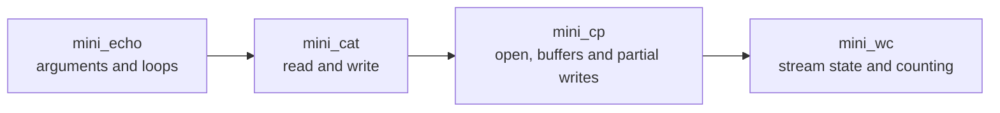

<div align="center">

# unix-toolbox

**Small Unix utilities, rebuilt from first principles in C.**

[](https://github.com/maximecoia/unix-toolbox/actions/workflows/ci.yml)
[](https://en.wikipedia.org/wiki/C99)
[](https://pubs.opengroup.org/onlinepubs/9699919799/)
[](LICENSE)
[](#project-status)

`mini_echo` → `mini_cat` → `mini_cp` → `mini_wc`

</div>

---

## About

`unix-toolbox` is a progressive collection of simplified Unix command-line utilities written in C.

The objective is not to reproduce every GNU or BSD feature. It is to understand the mechanisms beneath familiar shell commands: argument parsing, loops, pointers, byte streams, fixed-size buffers, file descriptors, system calls, state tracking, exit statuses, and error handling.

Each command introduces one additional layer of complexity:



## Project status

| Command | Core focus | Status |
|---|---|---|
| [`mini_echo`](mini_echo/) | `argc`, `argv`, nested traversal, output formatting | **Complete** |
| [`mini_cat`](mini_cat/) | standard input, files, `read()`, `write()`, buffers | Planned |
| [`mini_cp`](mini_cp/) | file descriptors, `open()`, binary-safe copying, partial writes | Planned |
| [`mini_wc`](mini_wc/) | stream processing, state transitions, line/word/byte counting | Planned |

Each unfinished command begins as a **compile-ready starter**, not a completed solution. A source remains inactive while it contains:

```c
/* PROJECT_STATUS: TODO */
```

The test runner reports that command as `SKIP`. Remove the marker only when your implementation is ready to face its behavioral tests.

## Learning targets

By completing the four programs, the project should consolidate:

- control flow with `if` and `while`;
- reconstruction from a written subject;
- `argc`, `argv`, strings, pointers, and indexes;
- fixed-size buffers and byte-oriented I/O;
- `open()`, `read()`, `write()`, and `close()`;
- end-of-file and partial-write handling;
- error messages, cleanup, and exit statuses;
- small, repeatable shell-based tests.

## Build

Requirements:

- a C99-compatible compiler;
- `make`;
- a POSIX-compatible shell.

Build every command:

```sh
make
```

Build one command:

```sh
make mini_echo
make mini_cat
make mini_cp
make mini_wc
```

Compiled programs are written to `bin/`.

Inspect implementation status:

```sh
make status
```

## Intended interfaces

### `mini_echo`

```sh
./bin/mini_echo hello unix world
# hello unix world
```

Print every operand separated by one space, then print one newline. Options are not interpreted.

### `mini_cat`

```sh
./bin/mini_cat notes.txt
./bin/mini_cat first.txt second.txt
printf 'hello\n' | ./bin/mini_cat
```

Copy bytes from standard input or from files to standard output. The operand `-` represents standard input.

### `mini_cp`

```sh
./bin/mini_cp source.txt destination.txt
```

Copy exactly one source file to one destination file. The copy must preserve bytes exactly, including binary data.

### `mini_wc`

```sh
./bin/mini_wc notes.txt
# 12 84 531 notes.txt
```

Count lines, words, and bytes. This simplified version has no flags and prints no aggregate `total` line.

## Test

Run every active suite:

```sh
make test
```

Compile and test in one command:

```sh
make check
```

Run a single suite:

```sh
sh tests/test_mini_cp.sh
```

A suite has three possible outcomes:

- `PASS` — the implementation satisfies the checked contract;
- `FAIL` — at least one behavior is incorrect;
- `SKIP` — the source still contains `PROJECT_STATUS: TODO`.

The tests cover normal input, empty input, invalid usage, missing files, multiple files, standard input, and binary data where relevant.

## Repository structure

```text
unix-toolbox/
├── .github/workflows/ci.yml
├── docs/
│   ├── concepts.md
│   ├── roadmap.md
│   └── workflow.md
├── mini_echo/
│   ├── README.md
│   └── mini_echo.c
├── mini_cat/
│   ├── README.md
│   └── mini_cat.c
├── mini_cp/
│   ├── README.md
│   └── mini_cp.c
├── mini_wc/
│   ├── README.md
│   └── mini_wc.c
├── tests/
│   ├── common.sh
│   ├── run.sh
│   └── test_mini_*.sh
├── .editorconfig
├── .gitignore
├── LICENSE
├── Makefile
└── README.md
```

## Engineering rules

1. **One program, one source file at first.** Split code only when a real responsibility boundary appears.
2. **No shared library prematurely.** A little duplication is clearer than an abstraction you do not yet understand.
3. **Treat input as bytes.** `mini_cat` and `mini_cp` must work with binary files, not only text.
4. **Check every system call.** Failure must never be silently ignored.
5. **Write diagnostics to standard error.** Standard output belongs to program data.
6. **Keep `main` functional.** Commit a command only after it compiles and its active tests pass.
7. **Prefer reconstruction over recognition.** Start from the subject, derive the state and loops, then write C.

## Documentation

- [`docs/roadmap.md`](docs/roadmap.md) — milestones and completion gates.
- [`docs/concepts.md`](docs/concepts.md) — the C and Unix mechanisms trained by each utility.
- [`docs/workflow.md`](docs/workflow.md) — the blank-page implementation and debugging process.

## Scope

This project deliberately excludes:

- GNU/BSD-compatible option parsing;
- recursive directory traversal;
- metadata or permission preservation;
- memory mapping;
- asynchronous I/O;
- localization and multibyte character semantics;
- optimizations that obscure the basic control flow.

These are learning-sized utilities, not drop-in replacements for the system commands.

## License

Distributed under the [MIT License](LICENSE).
