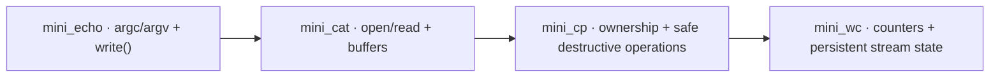

<div align="center">

# unix-toolbox

**Small Unix utilities rebuilt in C, one mechanism at a time.**

[](https://github.com/maximecoia/unix-toolbox/actions/workflows/ci.yml)
[](https://en.wikipedia.org/wiki/C99)

`mini_echo` → `mini_cat` → `mini_cp` → `mini_wc`

</div>

---

## About

`unix-toolbox` is a small post-Piscine project built to deepen my understanding of C and Unix programming through progressively more demanding command-line utilities.

Each program keeps a deliberately limited scope so the implementation can be understood end to end: inputs, state, control flow, system calls, failure paths, and exact observable behavior.

The goal is not to clone the full GNU/BSD commands. It is to rebuild a focused subset of their behavior and understand the mechanisms underneath.

## Progress

| Command | Main focus | Status |
|---|---|---|
| [`mini_echo`](mini_echo/) | `argc`, `argv`, nested traversal, `write()` | **Complete** |
| [`mini_cat`](mini_cat/) | file descriptors, `open()`, `read()`, buffers, EOF, partial writes | **Complete** |
| [`mini_cp`](mini_cp/) | multiple descriptors, safe `O_TRUNC`, file identity | **Complete** |
| [`mini_wc`](mini_wc/) | counters, stream state, checked result output | **Complete** |

## Progression


```mermaid
flowchart LR
    E["mini_echo · argc/argv + write()"]
    C["mini_cat · open/read + buffers"]
    P["mini_cp · ownership + safe destructive operations"]
    W["mini_wc · counters + persistent stream state"]

    E --> C --> P --> W
```

## Completed sequence

### mini_echo

```text
argv -> characters -> write()
```

Introduces argument traversal, separator placement, and checked byte output.

### mini_cat

```text
path -> open() -> read() -> buffer -> stdout
```

Introduces file descriptors, EOF, buffering, and partial writes.

### mini_cp

```text
source fd -> buffer -> destination fd
```

Adds multiple-resource ownership, destination creation/truncation, same-file detection, regular-file validation, and safety checks before destructive operations.

### mini_wc

```text
file -> buffer -> state transitions -> counters
```

Adds stream-wide state, word-boundary detection, byte/line/word counters, manual number formatting, and checked final output.

## Build

Requirements:

- a C99-compatible compiler;
- `make`;
- a POSIX-compatible shell.

Build everything:

```sh
make
```

Build one utility:

```sh
make mini_wc
```

Binaries are written to `bin/`. Two more builds exist for the tests only:
`make short` writes `bin/short/`, the same utilities with every `write()` cut
to one byte, and `make read_fault` writes `bin/read_fault/mini_cp`, whose
`read()` fails on demand.

## Test

Run all behavioral suites:

```sh
make test
```

Compile and test:

```sh
make check
```

Expected final result:

```text
==> test_mini_echo.sh
PASS: mini_echo

==> test_mini_cat.sh
PASS: mini_cat

==> test_mini_cp.sh
PASS: mini_cp

==> test_mini_wc.sh
PASS: mini_wc

==> test_short_write.sh
PASS: short writes

==> test_read_fault.sh
PASS: read faults

Suites: 6 passed, 0 skipped, 0 failed
```

A suite stops at its first failed check and prints its label, so `PASS` means
every check of that suite held.

## What the tests prove

A suite that passes proves nothing until it has been seen to fail. On
2026-09-30 each utility was broken on purpose, one change at a time, and the
suites were run again after `make clean`. The clean build matters: `make`
compares timestamps to the second, so a change saved in the same second as the
last build is not compiled, and the first run of this measurement caught
nothing for that reason. Of fourteen changes, thirteen are caught:

| Utility | What was broken | Caught by |
|---|---|---|
| `mini_echo` | the separator between operands dropped | `multiple operands output` |
| `mini_cat` | only the first `read()` kept | `text file bytes` |
| `mini_cat` | a failed `read()` taken for the end of the file | `directory operand` |
| `mini_cp` | the same-file check turned off | `same pathname` |
| `mini_cp` | the regular-file check turned off | `directory source preserves destination` |
| `mini_wc` | the word state reset at every `read()` | `word state survives buffer boundary` |
| `mini_wc` | a failed `read()` taken for the end of the file | `directory operand` |
| `mini_wc` | the tab no longer counted as whitespace | `whitespace counts` |
| `mini_cat` | a short write taken as complete | `mini_cat bytes under short writes` |
| `mini_cp` | a short write taken as complete | `mini_cp bytes under short writes` |
| `mini_wc` | a short write taken as complete | `mini_wc output under short writes` |
| `mini_cp` | a failed `read()` taken for the end of the file | `mini_cp read error` |
| `mini_cp` | an interrupted `read()` no longer retried | `mini_cp after an interrupted read` |

The two `directory operand` checks were added because this run found the read
error path untested: a directory passes `open()` and fails at `read()`, and no
case reached it before.

The three short-write checks needed more than a shell. A real `write()` may
return fewer bytes than it was asked for, on a pipe, a socket or a terminal,
but a shell test cannot make that happen on demand, so the loops that handle it
had never run under test. [`tests/short_write.c`](tests/short_write.c) is a
stand-in for `write()` that writes one byte per call, and `make short` rebuilds
each utility with `-Dwrite=short_write`, so every call it makes lands there. On
a 2004-byte file, `mini_cat` makes 1503 shortened calls and still returns every
byte. The redirection happens at compile time rather than through
`LD_PRELOAD` or `DYLD_INSERT_LIBRARIES`, so it behaves the same on Linux and on
macOS.

A stand-in that silently does nothing would make that suite pass for the wrong
reason, so each shortened call is logged, and the suite fails when a utility
made none. Building `bin/short/` without the redirection turns it red on
`mini_cat shortened calls was empty`.

The read error of `mini_cp` needed the same trick. A directory, the usual way
to make `read()` fail, is refused before the copy starts, so no shell test
reached that path. [`tests/read_fault.c`](tests/read_fault.c) stands in for
`read()`, and `make read_fault` rebuilds `mini_cp` with `-Dread=faulty_read`.
With `READ_FAULT=eio`, the first call reads and every later one fails with
`EIO`, so the error lands after 1024 bytes are copied: `mini_cp` must exit
non-zero and say why. With `READ_FAULT=eintr`, the first call fails with
`EINTR`, as a signal would make it, and the copy must still be whole. Each
injected fault is logged, and building `bin/read_fault/` without the
redirection turns the suite red on `mini_cp read error returned status 0`.

A third way to get the read error wrong, neither stopping on it nor retrying
it, makes `mini_cp` loop forever on the failing call. The suite then never
ends rather than failing, so the CI job stops after ten minutes instead of
GitHub's default of six hours.

One change still passes, and it is listed here rather than left to be found:
**one ignored write failure in `mini_echo`.** The check on the final newline
still fails, so the exit status stays right. The change is not observable, and
no test could catch it.

## Repository structure

```text
unix-toolbox/
├── mini_echo/
│   ├── README.md
│   └── mini_echo.c
├── mini_cat/
│   ├── README.md
│   └── mini_cat.c
├── mini_cp/
│   ├── README.md
│   └── mini_cp.c
├── mini_wc/
│   ├── README.md
│   └── mini_wc.c
├── tests/
├── docs/
├── .github/workflows/ci.yml
├── Makefile
└── README.md
```

## Project rules

- keep each utility small enough to understand end to end;
- derive control flow from required behavior rather than from remembered code;
- check system calls instead of assuming success;
- validate before destructive operations;
- preserve stream-wide state across buffer boundaries;
- test exact output, file contents, failure paths, and exit status;
- break each check on purpose before trusting it;
- add abstractions only when they solve a real problem.

## Status

The first `unix-toolbox` sequence is complete.

A detailed progression overview is available in [`docs/roadmap.md`](docs/roadmap.md).

The C that came after it is the libft, a 42 subject kept private by the
school's charter, and then the C inference engine of the ML Systems roadmap,
traced in [`learning_tree-ML-systems`](https://github.com/maximecoia/learning_tree-ML-systems).
