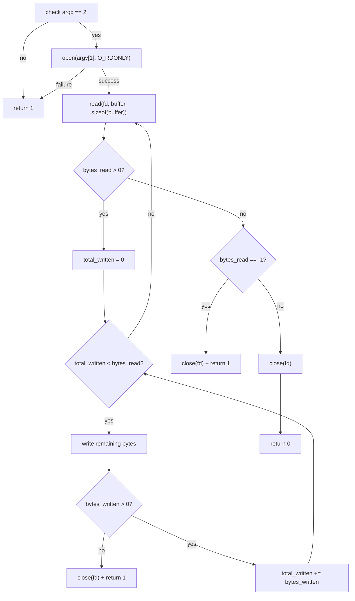

<div align="center">

# mini_cat

**A small one-file `cat` implementation in C using Unix system calls.**

[](#verification)
[](https://en.wikipedia.org/wiki/C99)

[`source`](mini_cat.c) · [`tests`](../tests/test_mini_cat.sh) · [`repository`](../README.md)

</div>

---

## Overview

`mini_cat` is the second completed utility in `unix-toolbox`.

It moves from bytes already available in `argv` to bytes coming from a file descriptor.

The scope is intentionally narrower than the real Unix `cat`: this version accepts exactly one file operand and copies its bytes to standard output.

## Behavior

```text
usage: mini_cat file
```

The program:

- requires exactly one file operand;
- opens that file read-only;
- reads it in fixed-size chunks;
- writes each chunk to standard output;
- preserves the bytes read from the file;
- keeps writing until a complete chunk has been emitted;
- stops successfully at EOF;
- returns non-zero when argument validation, `open()`, `read()`, or `write()` fails.

This version does not yet:

- read from standard input;
- accept several files;
- interpret `-` as standard input;
- print diagnostic messages.

Those behaviors are outside this milestone rather than hidden requirements.

## Core mechanism

The essential data flow is:

```text
file path
   |
   v
 open()
   |
   v
file descriptor
   |
   v
 read()
   |
   v
 buffer
   |
   v
 write()
   |
   v
stdout
```

The outer loop is controlled by `read()`:

```text
read() > 0  -> bytes are available
read() = 0  -> EOF
read() = -1 -> error
```

For every successful read, a second loop makes sure all returned bytes are written.

## Control flow



## Why the partial-write loop matters

A successful `read()` tells the program how many bytes are valid in the buffer:

```c
bytes_read = read(fd, buffer, sizeof(buffer));
```

That does not guarantee one `write()` call will emit all of them.

The implementation therefore tracks progress:

```text
bytes_read = bytes that must be emitted
total_written = bytes already emitted
bytes_read - total_written = bytes still remaining
```

The pointer expression:

```c
buffer + total_written
```

moves the next `write()` to the first byte that has not yet been emitted.

This pattern will be reused directly in `mini_cp`.

## Buffering

The current implementation uses:

```c
char buffer[4];
```

The small size is useful for learning because ordinary files require several `read()` iterations.

For example, an 11-byte file is processed conceptually as:

```text
read 4 -> write 4
read 4 -> write 4
read 3 -> write 3
read 0 -> EOF
```

Correctness should not depend on the buffer size.

## File-descriptor lifecycle

The descriptor belongs to the program after a successful `open()`:

```text
open succeeds
    |
    v
program owns fd
    |
    +--> normal EOF ------> close(fd)
    |
    +--> read failure ----> close(fd)
    |
    +--> write failure ---> close(fd)
```

That ownership rule becomes more important in `mini_cp`, where both a source and destination descriptor will exist.

## Verification

Build:

```sh
make mini_cat
```

Run the dedicated suite:

```sh
sh tests/test_mini_cat.sh
```

The tests cover:

- a normal text file;
- data larger than the four-byte buffer;
- an empty file;
- byte preservation with binary data;
- missing operands;
- too many operands;
- a nonexistent input file;
- successful exit status for valid input;
- non-zero exit status for invalid or failed input.

Expected result:

```text
PASS: mini_cat
```

## Takeaways

`mini_echo` taught:

```text
argv -> characters -> write()
```

`mini_cat` adds:

```text
path -> open() -> fd
fd -> read() -> buffer -> write()
```

The reusable core is now a stream-copy loop.

Next: [`mini_cp`](../mini_cp/), where the same bytes will be written to a destination file instead of standard output.
