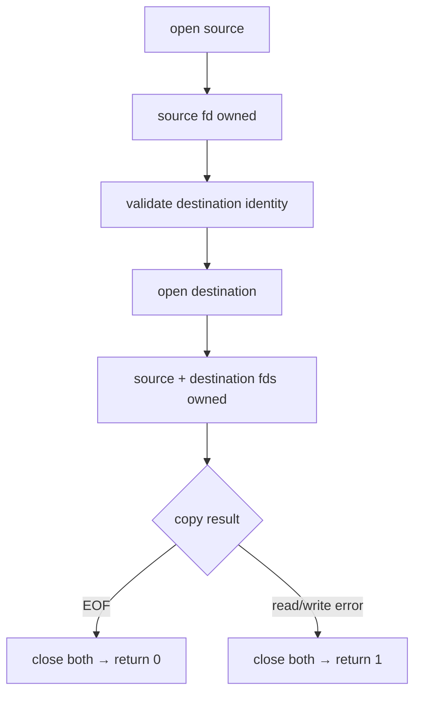

<div align="center">

# mini_cp

**A small file-copy utility in C built directly on Unix system calls.**

[](#verification)
[](https://en.wikipedia.org/wiki/C99)

[`source`](mini_cp.c) · [`tests`](../tests/test_mini_cp.sh) · [`repository`](../README.md)

</div>

---

## Overview

`mini_cp` is the third completed utility in `unix-toolbox`.

It reuses the buffered read/write loop from `mini_cat`, but changes the output side from standard output to a second file descriptor owned by the program.

The scope is intentionally smaller than the real Unix `cp`.

## Behavior

```text
usage: mini_cp source destination
```

The program:

- requires exactly one source and one destination;
- opens the source with `O_RDONLY`;
- identifies the source with `fstat()`;
- checks an existing destination with `stat()`;
- refuses to continue if source and destination resolve to the same device and inode;
- creates the destination when it does not exist;
- truncates an existing destination before copying;
- copies bytes through a 1024-byte buffer;
- handles partial writes;
- retries interrupted `read()` and `write()` calls;
- returns non-zero on usage or I/O failure.

The destination is created with mode `0644`, subject to the process umask.

## Why same-file detection comes before `O_TRUNC`

The dangerous sequence would be:

```text
open source
    |
open destination with O_TRUNC
    |
source and destination were the same file
    |
source data is already gone
```

Comparing pathname strings is not enough because different paths can refer to the same underlying file.

For example:

```text
data.txt
./data.txt
hard-link-to-data.txt
```

may all resolve to the same inode.

The implementation therefore compares file identity:

```c
src_stat.st_dev == dst_stat.st_dev
&& src_stat.st_ino == dst_stat.st_ino
```

and performs that check before opening the destination with `O_TRUNC`.

## Data flow

```text
source path
    |
    v
 open(O_RDONLY)
    |
    v
 source fd
    |
    +---- fstat() ----+
    |                 |
    |          source identity
    |                 |
    |     stat(destination)
    |                 |
    |       same file? ---- yes ---> fail safely
    |                 |
    |                no
    |                 v
    |       open(destination,
    |        O_WRONLY | O_CREAT | O_TRUNC)
    |                 |
    v                 v
 read()            destination fd
    |                 ^
    v                 |
 buffer ------> write_all()
```

## Copy loop

The outer loop owns input:

```text
read() > 0  -> copy this chunk
read() = 0  -> EOF, copy complete
read() < 0  -> retry EINTR or fail
```

Each successful `read()` produces exactly `bytes_read` valid bytes.

Those bytes are passed to `write_all()`.

## `write_all()`

`write()` is allowed to write fewer bytes than requested.

The helper therefore tracks progress:

```text
total_written = 0

while total_written < bytes_read:
    write(buffer + total_written,
          bytes_read - total_written)

    advance total_written
```

The pointer expression:

```c
buffer + total_written
```

moves to the first byte that has not yet been copied.

This separates two responsibilities cleanly:

```text
main()       -> decides which chunks must be copied
write_all()  -> guarantees one chunk is fully written or reports failure
```

## File-descriptor ownership

After successful opens, the program owns two descriptors:

```text
source fd
destination fd
```

That creates more cleanup paths than `mini_cat`.



The important rule is that every failure path closes the descriptors that have already been acquired.

## What this version copies

`mini_cp` copies the file's byte contents.

It does not attempt to preserve all filesystem metadata.

Out of scope for this milestone:

- directory recursion;
- permission/mode preservation from the source;
- ownership preservation;
- timestamps;
- extended attributes;
- sparse-file optimization;
- atomic destination replacement;
- hardening against the race between `stat()` and destination `open()`;
- treating a `close()` failure as a copy failure.

That boundary keeps the project focused on descriptors, buffered I/O, destructive open flags, and cleanup.

## Verification

Build:

```sh
make mini_cp
```

Run the dedicated suite:

```sh
sh tests/test_mini_cp.sh
```

The tests cover:

- a normal text file;
- an empty file;
- data larger than the 1024-byte buffer;
- binary byte preservation;
- truncation of a longer existing destination;
- missing and extra operands;
- a missing source;
- an invalid destination path;
- source and destination using the same pathname;
- two different paths resolving to the same file;
- a hard-link alias of the source;
- preservation of source bytes when same-file copies are rejected.

Expected result:

```text
PASS: mini_cp
```

## Takeaways

The progression is now:

```text
mini_echo:
argv -> characters -> write()

mini_cat:
path -> open() -> read() -> buffer -> stdout

mini_cp:
source path -> source fd
destination path -> destination fd
source fd -> read() -> buffer -> write_all() -> destination fd
```

The new idea is not merely "write to another file."

It is **resource ownership plus destructive-operation safety**: once more than one descriptor and `O_TRUNC` are involved, the order of operations becomes part of correctness.

Next: [`mini_wc`](../mini_wc/).
