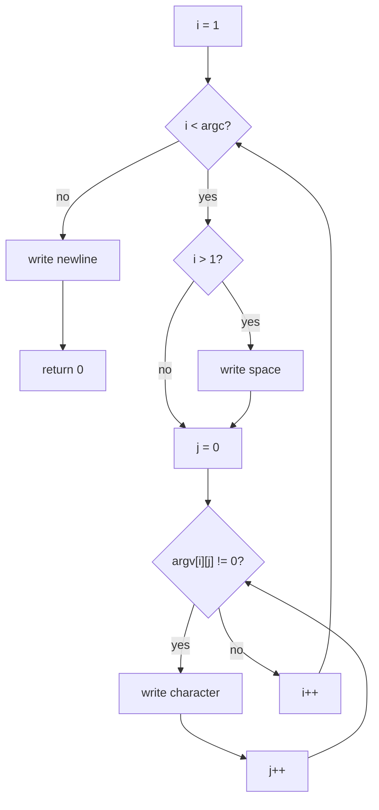

<div align="center">

# mini_echo

**A small `echo` implementation in C using `write()`.**

[](#verification)
[](https://en.wikipedia.org/wiki/C99)

[`source`](mini_echo.c) · [`tests`](../tests/test_mini_echo.sh) · [`repository`](../README.md)

</div>

---

## Overview

`mini_echo` is the first completed utility in `unix-toolbox`.

The scope is deliberately small: command-line argument traversal, exact output formatting, and error handling around `write()`.

The implementation stays in one C file and avoids option parsing, allocation, and string-library helpers.

## Behavior

```text
usage: mini_echo [operand ...]
```

The program:

- prints operands in their original order;
- places one space between adjacent operands;
- prints no leading or trailing separator;
- always ends with one newline;
- treats dash-prefixed arguments as ordinary text;
- prints only a newline when there are no operands;
- returns non-zero if output fails.

Examples:

```sh
./bin/mini_echo hello
# hello

./bin/mini_echo hello unix world
# hello unix world

./bin/mini_echo "hello world" "" tail
# hello world  tail

./bin/mini_echo -n hello
# -n hello
```

## Implementation

The program has two traversal levels:

```text
argv
 └── operand i
      └── character j
```

The outer loop starts at the first operand:

```c
i = 1;
while (i < argc)
```

Inside it, `j` traverses the current C string:

```c
j = 0;
while (argv[i][j] != '\0')
```

The separator rule is simple:

```text
space before every operand except the first
```

That avoids a trailing-space special case and still handles empty operands correctly.

Each output operation requests one byte through `write()`, and every call is checked.

## Control flow



All three kinds of output—separator, character, and final newline—have an immediate failure path if `write()` does not report the requested byte.

## Implementation notes

A few details mattered more than the size of the program suggests.

### Keep loop responsibilities separate

The two indexes have different ownership:

```text
j advances after one character
i advances after one operand
```

One early control-flow issue came from tying operand advancement to the separator branch. Keeping traversal and formatting independent makes the loop structure much easier to reason about.

### Place separators before later operands

Printing a space before every operand except the first naturally guarantees:

- no leading separator;
- no trailing separator;
- exactly one separator between adjacent operands.

It also works for empty operands without additional branching.

### Treat `write()` as an operation with a result

For this implementation every call requests one byte.

```text
write() returns 1 -> that output operation succeeded
main() returns 0  -> the entire program succeeded
```

Keeping those two return conventions separate makes the failure path explicit.

### Verify the executable you are actually running

During development I once edited the source and then ran an older binary.

That reinforced the actual loop:

```text
edit -> compile -> run -> inspect
```

Source and executable are separate artifacts.

## Verification

Build:

```sh
make mini_echo
```

Run the dedicated test suite:

```sh
sh tests/test_mini_echo.sh
```

Current result:

```text
PASS: mini_echo
```

The tests cover:

- zero operands;
- one operand;
- multiple operands;
- embedded spaces;
- empty operands;
- dash-prefixed operands;
- exact stdout;
- successful stderr behavior.

For byte-visible manual inspection:

```sh
./bin/mini_echo "" A "" | cat -e
```

Expected:

```text
 A $
```

The `$` is `cat -e` showing the final newline.

## Takeaways

The reusable structure is:

```text
arguments
    -> characters
        -> output
```

The next utility changes where the bytes come from:

```text
mini_echo: argv -> characters -> write()
mini_cat:  fd -> read() -> buffer -> write()
```

Next: [`mini_cat`](../mini_cat/).
