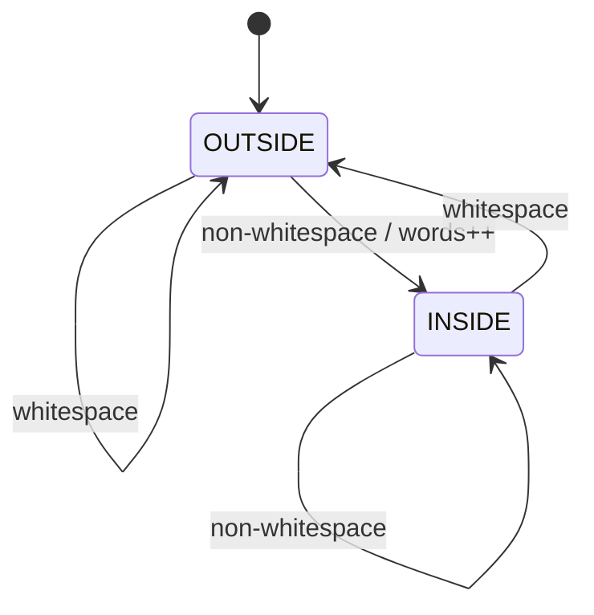
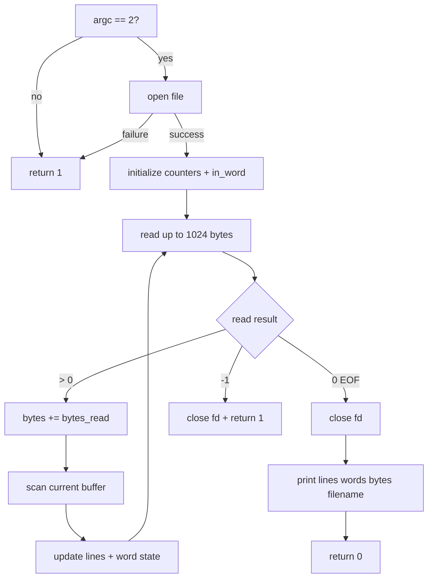

<div align="center">

# mini_wc

**A small `wc`-like utility in C built around buffered input and persistent stream state.**

[](#verification)
[](https://en.wikipedia.org/wiki/C99)

[`source`](mini_wc.c) · [`tests`](../tests/test_mini_wc.sh) · [`repository`](../README.md)

</div>

---

## Overview

`mini_wc` is the fourth completed utility in `unix-toolbox` and closes the first project sequence.

Unlike `mini_cat` and `mini_cp`, the bytes are no longer merely transferred. Every byte can change program state.

The scope is intentionally smaller than the real Unix `wc`: this version accepts exactly one named file and always prints line, word, and byte counts.

## Behavior

```text
usage: mini_wc file
```

Output:

```text
lines words bytes filename
```

For example, a file containing:

```text
hello world
second line
```

produces:

```text
2 4 24 filename
```

The program:

- requires exactly one file operand;
- opens it read-only;
- reads through a 1024-byte buffer;
- counts every byte returned by `read()`;
- counts `'\n'` bytes as lines;
- counts words from transitions into non-whitespace text;
- keeps word state between separate `read()` calls;
- writes the three counters and filename to standard output;
- returns non-zero on invalid arguments, `open()` failure, or `read()` failure.

## Three counters, three rules

### Bytes

The byte count comes directly from `read()`:

```text
bytes += bytes_read
```

There is no need to inspect individual characters to count bytes.

### Lines

A line is counted whenever the input contains:

```c
'\n'
```

Therefore a non-empty file without a final newline can still have a line count of `0`, matching the counting rule used by `wc -l`.

### Words

Words require state.

The implementation considers these characters whitespace:

```text
space
tab
newline
vertical tab
form feed
carriage return
```

A new word is counted only when a non-whitespace byte is encountered while the program is currently outside a word.

```text
whitespace -> non-whitespace = new word
non-whitespace -> non-whitespace = same word
non-whitespace -> whitespace = leave word
```

## Why `in_word` must survive buffer boundaries

A buffer boundary is an implementation detail, not a word boundary.

Suppose one long word crosses two reads:

```text
read #1                         read #2
aaaaaaaaaaaaaaaa...aaaaaaaa | aaaaaaaaaaaa
                             ^
                         no whitespace
```

If `in_word` were reset at the beginning of every buffer, the second chunk would incorrectly create another word.

Instead:

```text
in_word initialized once
        |
        v
read chunk -> inspect bytes
        |
        v
next read keeps previous in_word state
```

This is the central new mechanism in `mini_wc`.

## State machine



The state machine is small, but it must describe the entire stream rather than one individual buffer.

## Buffered processing

The complete data path is:

```text
filename
   |
   v
 open()
   |
   v
file descriptor
   |
   v
 read(1024 bytes)
   |
   +--> bytes += bytes_read
   |
   v
inspect each valid byte
   |
   +--> newline? -> lines++
   |
   +--> whitespace? -> update in_word
   |
   v
next read with state preserved
   |
   v
EOF
   |
   v
print counts + filename
```

Only the `bytes_read` bytes returned by the current `read()` are inspected.

## Output without `printf()`

The final version keeps the output path close to earlier Piscine patterns.

`putnbr()` recursively decomposes a non-negative counter into decimal digits:

```text
123
 |
 +--> print 12
 |      |
 |      +--> print 1
 |      +--> print 2
 |
 +--> print 3
```

`ft_strlen()` provides the filename length, and `write()` emits counters, separators, the filename, and the final newline.

This makes number formatting part of the exercise rather than delegating it to formatted I/O.

## Control flow



## Scope boundaries

This milestone deliberately does not implement the full `wc` interface.

Out of scope:

- standard-input mode;
- several input files;
- aggregate `total` output;
- command-line flags such as `-l`, `-w`, or `-c`;
- character-count versus byte-count distinctions for multibyte locales;
- locale-aware whitespace classification;
- diagnostics beyond the process exit status.

The goal is the buffered state machine, not option parsing.

## Verification

Build:

```sh
make mini_wc
```

Run the dedicated suite:

```sh
sh tests/test_mini_wc.sh
```

The tests cover:

- an empty file;
- known line/word/byte counts;
- a file without a final newline;
- every whitespace class handled by `is_space()`;
- a long word crossing the 1024-byte read boundary;
- a separator exactly at a buffer boundary;
- a filename containing spaces;
- missing and extra operands;
- a nonexistent input file;
- exact stdout and successful stderr behavior.

Expected result:

```text
PASS: mini_wc
```

## Takeaways

The whole first sequence now forms one progression:

```text
mini_echo:
argv -> characters -> write()

mini_cat:
file -> read() -> buffer -> write()

mini_cp:
source fd -> read() -> buffer -> destination fd

mini_wc:
file -> read() -> buffer -> state transitions -> counters
```

`mini_wc` changes the role of the buffer.

In the previous utilities, the buffer mainly transported bytes. Here, the buffer is a temporary window over a longer stream, while the meaningful state lives outside it.

That distinction—**buffer-local data versus stream-wide state**—is the main lesson of the project.
